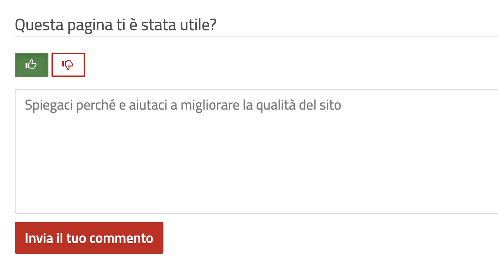

==========================
RER: Customer satisfaction
==========================

Add a form (viewlet) for the customer satisfaction on site contents.

Users can add a vote (positive or negative) and a comment to every page on the site.

Bot protection
==============

This product use `collective.honeypot <https://pypi.org/project/collective.honeypot/>`_ to prevent bot submissions.

You just need to set two environment variables:

- *EXTRA_PROTECTED_ACTIONS customer-satisfaction-add*
- *HONEYPOT_FIELD xxx*

xxx should be a field name that bot should compile.

If you get hacked, you could simply change that variable.

Permissions
===========

There are two new specific permission:

- rer.customersatisfaction.AddCustomerSatisfactionVote (rer.customersatisfaction: Add Customer Satisfaction Vote) Allows users to vote (by default Anonymous).
- rer.customersatisfaction.ManageCustomerSatisfaction (rer.customersatisfaction: Manage Customer Satisfaction) Allows to reset data (by default Manager and Site Administrator).
- rer.customersatisfaction.ShowDeletedFeedbacks (rer.customersatisfaction: Show Deleted Feedbacks) Allow list also feedbacks from deleted contents (by default Manager and Site Administrator)
- rer.customersatisfaction.AccessCustomerSatisfaction (rer.customersatisfaction: Access Customer Satisfaction) Allows users to list feedbacks on contents where they have that permission (by default Editor, Manager and Site Administrator)

Feedbacks catalog
=================

Reviews are stored inside an internal catalog (based on `souper.plone <https://pypi.org/project/souper.plone/>`_).

You can access/edit data through restapi routes (see below) or through a Plone utility::

    from zope.component import getUtility
    from rer.customersatisfaction.interfaces import ICustomerSatisfactionStore

    tool = getUtility(ICustomerSatisfactionStore)

Add a vote
----------

- Method ``add``
- Parameters: ``data`` (dictionary with parameters)
- Response: unique-id of new record

``data`` should be a dictionary with the following parameters:

- uid [required]: the uid of the Plone content
- vote [required]: the vote (should be **1** or **-1**)
- title: the title of the Plone content
- comment: an optional comment

Othere parameters will be ignored.

Search reviews
--------------

- Method ``search``
- Parameters: ``query`` (dictionary with parameters), ``sort_index`` (default=date), ``reverse`` (default=False)
- Response: a list of results

``query`` is a dictionary of indexes where perform the search.

Right now data is not indexed so search filters does not work. You only need to call search method to get all data.

restapi routes
==============

Add a vote
----------

*@customer-satisfaction-add*

**POST** endpoint that need to be called on a site content.

Only users with "rer.customersatisfaction.AddCustomerSatisfactionVote" can post it::

> curl -i -X POST http://localhost:8080/Plone/front-page/@customer-satisfaction-add -H 'Accept: application/json' -H 'Content-Type: application/json' --data-raw '{"vote": "1", "xxx": ""}' --user admin:admin

If vote is successful, the response is a ``204``.

Feedbacks listing
=================

There is a view (a link is also available on user menu in sidebar) that shows all infos about feedbacks: @@customer-satisfaction

The list of feedbacks is filtered based on some permissions.

Comments listing
================

Users with *rer.customersatisfaction.AccessCustomerSatisfaction* can call **@@show-feedbacks**
view on a content, to see a detailed list of feedbacks and comments.

Installation
============

Add rer.customersatisfaction to buildout::

    [buildout]

    ...

    eggs =
        rer.customersatisfaction

If you need collective.recaptcha support, add the egg like this::

   ...

   eggs =
       rer.customersatisfaction[collective_recaptcha]

and run ``bin/buildout`` command.

Contribute
==========

- Issue Tracker: https://github.com/RegioneER/rer.customersatisfaction/issues
- Source Code: https://github.com/RegioneER/rer.customersatisfaction

Compatibility
=============

This product has been tested on Plone 5.1 and 5.2

Credits
=======

Developed with the support of `Regione Emilia Romagna`__;

Regione Emilia Romagna supports the `PloneGov initiative`__.

__ http://www.regione.emilia-romagna.it/
__ http://www.plonegov.it/

Authors
=======

This product was developed by RedTurtle Technology team.

.. image:: http://www.redturtle.net/redturtle_banner.png
   :alt: RedTurtle Technology Site
   :target: http://www.redturtle.net/
